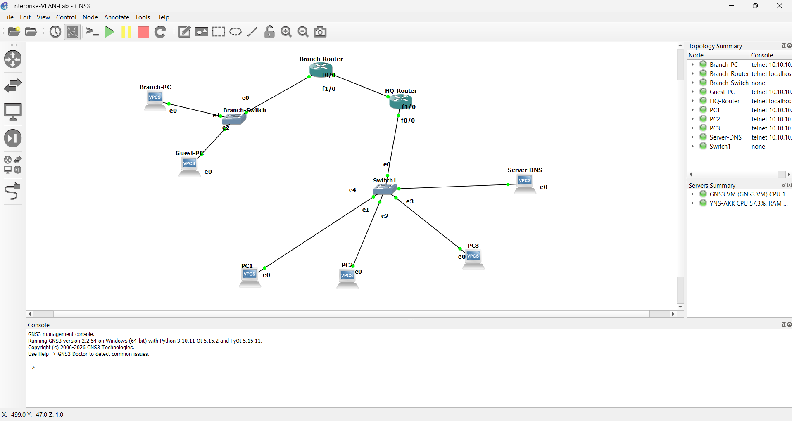
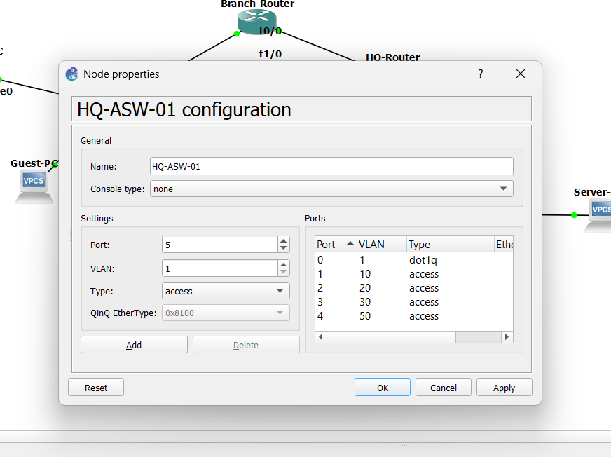
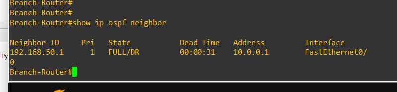

# 🏢 Enterprise Multi-Site Network Architecture with VLAN Segmentation & Dynamic OSPF Routing

## 📝 Project Overview
This project demonstrates the design and deployment of a secure, scalable multi-site enterprise network infrastructure using **GNS3**. The architecture connects a corporate Headquarters (HQ) containing segregated departmental zones and a secure Data Center (DMZ) to a remote Branch Office (BO) via a high-speed WAN backbone link. 

To optimize routing and ensure high availability, **Router-on-a-Stick (802.1Q)** is utilized for inter-VLAN routing, and **OSPF (Open Shortest Path First)** handles dynamic path determination across the network boundaries.

---

## 🗺️ Topology Design & IP Schema

### 📸 Topology Overview


### Network Address Allocations
| Site / Zone | Network Role | VLAN ID | Subnet Mask | Gateway IP | Assigned Node IP |
| :--- | :--- | :---: | :--- | :--- | :--- |
| **HQ** | Management Clients | `10` | `255.255.255.0` (`/24`) | `192.168.10.1` | `192.168.10.10` (PC1) |
| **HQ** | Standard Staff / HR | `20` | `255.255.255.0` (`/24`) | `192.168.20.1` | `192.168.20.10` (PC2) |
| **HQ** | Secure DMZ Server Zone | `50` | `255.255.255.0` (`/24`) | `192.168.50.1` | `192.168.50.10` (Server-DNS) |
| **Branch** | Remote Office Staff | `30` | `255.255.255.0` (`/24`) | `192.168.30.1` | `192.168.30.20` (Branch-PC) |
| **Branch** | Isolated Guest Network | `40` | `255.255.255.0` (`/24`) | `192.168.40.1` | `192.168.40.10` (Guest-PC) |
| **WAN Link** | Inter-Router Backbone | *N/A* | `255.255.255.252` (`/30`)| *Point-to-Point* | `10.0.0.1` (HQ) / `10.0.0.2` (BO) |

---

## 🛠️ Switch Port Allocation Matrix

### 📸 Logical Switch Properties


### 1. Headquarters Switch (`HQ-ASW-01`)
* **Port e0:** `802.1Q Tagged Trunk Link` $\rightarrow$ Connecting to `HQ-Router (f0/0)`
* **Port e1:** Access Mode — `VLAN 10` (Management Workstation)
* **Port e2:** Access Mode — `VLAN 20` (Staff Workstation)
* **Port e3:** Access Mode — `VLAN 30` (Fallback Management)
* **Port e4:** Access Mode — `VLAN 50` (DMZ Infrastructure Domain Controller / DNS)

### 2. Remote Branch Switch (`BR-ASW-01`)
* **Port e0:** `802.1Q Tagged Trunk Link` $\rightarrow$ Connecting to `Branch-Router (f1/0)`
* **Port e1:** Access Mode — `VLAN 40` (Public Guest Wi-Fi Zone)
* **Port e2:** Access Mode — `VLAN 30` (Branch Employee Workstation)

---

## 💻 Router Configuration Scripts (Cisco IOS)

```
=====================================================================
1. Headquarters Core Gateway (HQ-Router Configuration)
=====================================================================
enable
configure terminal
hostname HQ-Router

# Activate the physical Local LAN connection
interface FastEthernet0/0
 no shutdown
exit

# 802.1Q Sub-Interfaces Setup
interface FastEthernet0/0.10
 description HQ_Management_VLAN_10
 encapsulation dot1Q 10
 ip address 192.168.10.1 255.255.255.0
exit

interface FastEthernet0/0.20
 description HQ_Staff_VLAN_20
 encapsulation dot1Q 20
 ip address 192.168.20.1 255.255.255.0
exit

interface FastEthernet0/0.50
 description HQ_Secure_DMZ_VLAN_50
 encapsulation dot1Q 50
 ip address 192.168.50.1 255.255.255.0
exit

# Point-to-Point Backbone WAN Link Configuration
interface FastEthernet1/0
 description WAN_Backbone_To_Branch
 ip address 10.0.0.1 255.255.255.252
 no shutdown
exit

# Dynamic OSPF Routing Domain Configuration
router ospf 1
 log-adjacency-changes
 network 192.168.10.0 0.0.0.255 area 0
 network 192.168.20.0 0.0.0.255 area 0
 network 192.168.50.0 0.0.0.255 area 0
 network 10.0.0.0 0.0.0.3 area 0
end
write memory


=====================================================================
2. Remote Office Gateway (Branch-Router Configuration)
=====================================================================
enable
configure terminal
hostname Branch-Router

# Activate the physical Remote LAN connection
interface FastEthernet1/0
 no shutdown
exit

# 802.1Q Sub-Interfaces Setup
interface FastEthernet1/0.30
 description Branch_Staff_VLAN_30
 encapsulation dot1Q 30
 ip address 192.168.30.1 255.255.255.0
exit

interface FastEthernet1/0.40
 description Branch_Guests_VLAN_40
 encapsulation dot1Q 40
 ip address 192.168.40.1 255.255.255.0
exit

# Point-to-Point Backbone WAN Link Configuration
interface FastEthernet0/0
 description WAN_Backbone_To_HQ
 ip address 10.0.0.2 255.255.255.252
 no shutdown
exit

# Dynamic OSPF Routing Domain Configuration
router ospf 1
 log-adjacency-changes
 network 192.168.30.0 0.0.0.255 area 0
 network 192.168.40.0 0.0.0.255 area 0
 network 10.0.0.0 0.0.0.3 area 0
end
write memory


=====================================================================
3. Live Routing Tables & Neighbor Adjacency Verification
=====================================================================


Branch-Router# show ip ospf neighbor

Neighbor ID     Pri   State           Dead Time   Address         Interface
192.168.50.1      1   FULL/DR         00:00:31    10.0.0.1        FastEthernet0/0
